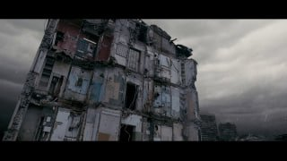

+++
title = ""
date = 2023-08-14T05:38:48+00:00
description = "film daywatch Дневной Дозор: конец, эпизод с исправлением судьбы From"

[taxonomies]
days = ["2023-08-14"]
tags = ["film", "day_watch"]

[extra]
id = 30
day = "2023-08-14"
tg_url = "https://t.me/vitaly_zdanevich_chan/30"
og_image = "01.jpg"
next_id = 31
next_title = ""
next_body = "#film\n#scifi\nLove, Death & Robots: ending from s1ep7 Beyond the Aquila Rift"
prev_id = 29
prev_title = ""
prev_body = "#film\n#nightwatch\nNight Watch: episode with witch, in the beginning"
views = 90
ids = [30]

[[extra.related]]
path = "@/posts/2024-02-26-32/index.md"
label = "#film Love, Sex & Robots S1.E3: The Witness"

[[extra.related]]
path = "@/posts/2025-11-13-778/index.md"
label = "#film #kindzadza Гамарджоба At 1:50:00"

[[extra.related]]
path = "@/posts/2025-10-03-696/index.md"
label = "#film #scifi Love, Death & Robots: fan mashup of s1ep7 Beyond th…"

[[extra.related]]
path = "@/posts/2024-06-11-53/index.md"
label = "#film #nightwatch Night Watch, love it"

[[extra.related]]
path = "@/posts/2024-02-24-31/index.md"
label = "#film #scifi Love, Death & Robots: ending from s1ep7 Beyond the…"
+++

{{ tag(t="film") }}  
{{ tag(t="day_watch") }}  

Дневной Дозор: конец, эпизод с исправлением судьбы  

From <https://vk.com/video4826534_456240329>

*▶ video — 3:36*
