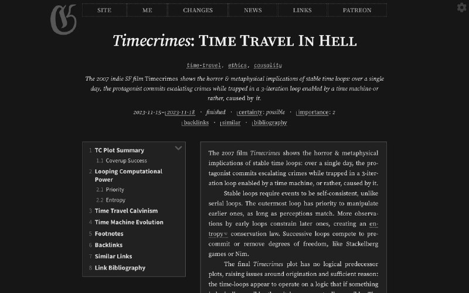

+++
title = ""
date = 2024-04-27T07:22:45+00:00
description = "This website looks soooo special design"

[taxonomies]
days = ["2024-04-27"]
tags = ["design"]

[extra]
id = 34
day = "2024-04-27"
tg_url = "https://t.me/vitaly_zdanevich_chan/34"
og_image = "5289892081118075189_1231648978_456251701.jpg"
next_id = 35
next_title = ""
next_body = "Forked and fixed my lovely Geeknote. After so many years as a user - now it my"
prev_id = 33
prev_title = ""
prev_body = "&gt; For example, anhedonia, which is often associated with depression, decreases an individual's desire to participate in activities that provide short-term rewards, and instead, allows the individual to concentrate on long-term goals"
views = 48
ids = [34]
+++

This website looks soooo special [https://gwern.net](https://gwern.net/) {{ tag(t="design") }}

