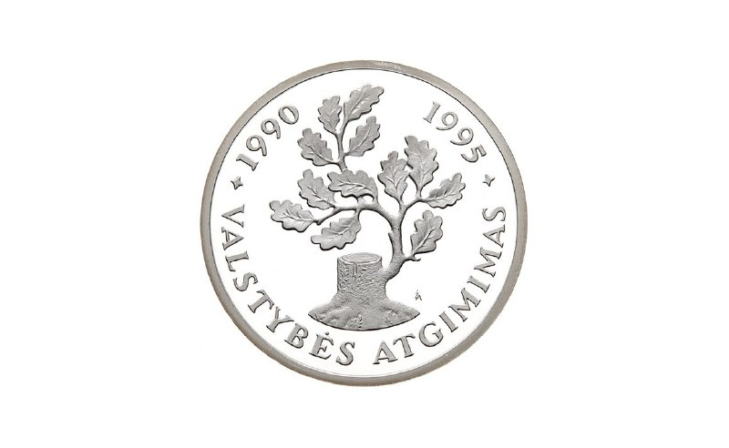

+++
title = ""
date = 2024-05-06T17:58:14+00:00
description = "Coin 5 years of Lithuania independence, from coin"

[taxonomies]
days = ["2024-05-06"]
tags = ["coin"]

[extra]
id = 42
day = "2024-05-06"
tg_url = "https://t.me/vitaly_zdanevich_chan/42"
og_image = "5316864029060357579_1237928874_456252875.jpg"
next_id = 43
next_title = ""
prev_id = 41
prev_title = ""
views = 45
ids = [42]
+++

Coin 5 years of Lithuania independence, from [https://commons.wikimedia.org/wiki/File:Монета\_5\_лет\_Независимости\_50\_литов\_back.jpg](https://commons.wikimedia.org/wiki/File:%D0%9C%D0%BE%D0%BD%D0%B5%D1%82%D0%B0_5_%D0%BB%D0%B5%D1%82_%D0%9D%D0%B5%D0%B7%D0%B0%D0%B2%D0%B8%D1%81%D0%B8%D0%BC%D0%BE%D1%81%D1%82%D0%B8_50_%D0%BB%D0%B8%D1%82%D0%BE%D0%B2_back.jpg) {{ tag(t="coin") }}

