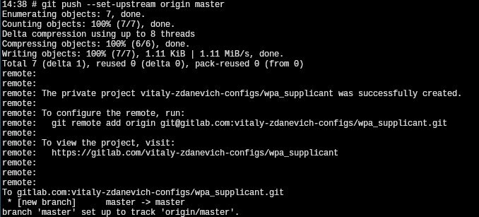

+++
title = ""
date = 2024-06-03T10:46:31+00:00
description = "gitlab: I love that it is possible to push to a repo that is not exists yet - it will be created (private by default), and terminal will print a link to configure it. Its a dream to work for some…"

[taxonomies]
days = ["2024-06-03"]
tags = ["gitlab", "wikimedia"]

[extra]
id = 50
day = "2024-06-03"
tg_url = "https://t.me/vitaly_zdanevich_chan/50"
og_image = "5400135666744023014_1257317063_456251366.jpg"
next_id = 51
next_title = ""
prev_id = 49
prev_title = ""
views = 54
ids = [50]
+++

{{ tag(t="gitlab") }}: I love that it is possible to push to a repo that is not exists yet - it will be created (private by default), and terminal will print a link to configure it.  

Its a dream to work for some open source company like {{ tag(t="gitlab") }} or {{ tag(t="wikimedia") }}, maybe in one day...

