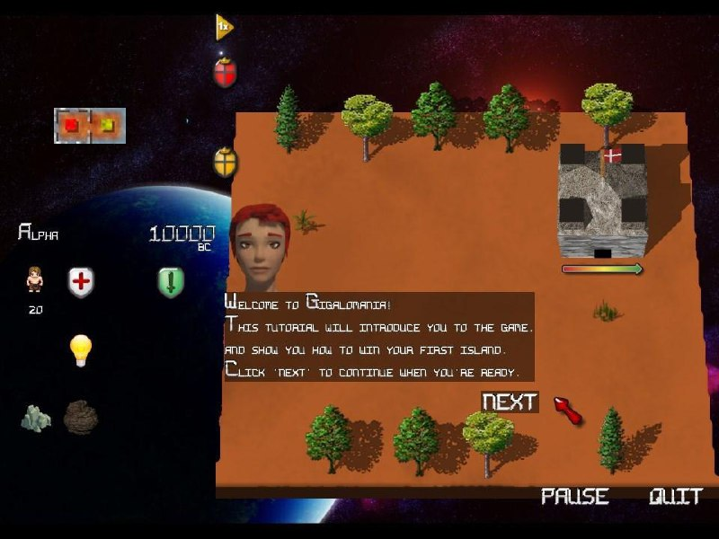

+++
title = "My another ebuild: the game Gigalomania - libre clone of Mega-Lo-Mania."
date = 2024-06-04T17:37:34+00:00
description = "My another ebuild: the game Gigalomania - libre clone of Mega-Lo-Mania. Looks bad - if you a designer - you can help."

[extra]
tg_url = "https://t.me/vitaly_zdanevich_chan/51"
og_image = "5402581027848838338_1257886418_456252610.jpg"
next_id = 52
next_title = "I love this project: free personal VPN on WireGuard (integrated into Linux kernel), works on AWS free tier also"
prev_id = 50
prev_title = "gitlab: I love that it is possible to push to a repo that is not exists yet - it will be created (private by default), and terminal will print a link to configure it."
views = 53
ids = [51]
+++

My another ebuild: the game [Gigalomania](https://github.com/gentoo/guru/tree/3e6390be5c1d89b3c05ddcc5923cbfa0e7463fab/games-strategy/gigalomania) - libre clone of Mega-Lo-Mania. Looks bad - if you a designer - you can help.

<https://gigalomania.sourceforge.net/>

