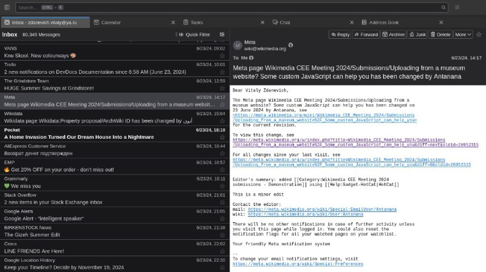

+++
title = "Tried thunderbird again, after many years - and its good."
date = 2024-06-24T05:05:38+00:00
description = "Tried thunderbird again, after many years - and its good. UI space can be optimized though - to be more compact. Even Google Calendar sync (with an extension)."

[taxonomies]
tags = ["thunderbird"]

[extra]
tg_url = "https://t.me/vitaly_zdanevich_chan/80"
og_image = "5460889881816455526_1271462506_456251750.jpg"
next_id = 81
next_title = "Wow, DIY laptop with easy interchangeable parts"
prev_id = 79
prev_title = "Love my designs"
views = 53
ids = [80]
+++

Tried {{ tag(t="thunderbird") }} again, after many years - and its good. UI space can be optimized though - to be more compact. Even Google Calendar sync (with an extension).

