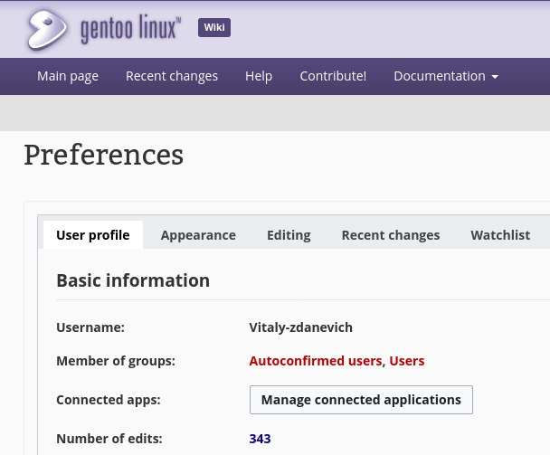

+++
title = ""
date = 2024-06-30T16:30:08+00:00
description = "I contribute to wikipedia and other projects on mediawiki engine and other wikis like mdn. When I talk with somebody about his technical problem - sometimes I say something like \"...and when you…"

[taxonomies]
days = ["2024-06-30"]
tags = ["wikipedia", "mediawiki", "mdn", "reddit"]

[extra]
id = 82
day = "2024-06-30"
tg_url = "https://t.me/vitaly_zdanevich_chan/82"
og_image = "5190535735076315675_1208515776_456253979.jpg"
next_id = 83
next_title = ""
prev_id = 81
prev_title = ""
views = 61
ids = [82]
+++

I contribute to {{ tag(t="wikipedia") }} and other projects on {{ tag(t="mediawiki") }} engine and other wikis like {{ tag(t="mdn") }}. When I talk with somebody about his technical problem - sometimes I say something like "...and when you finally figure out the root cause - please check some related wiki about that and 𝐮𝐩𝐝𝐚𝐭𝐞 𝐢𝐭 𝐢𝐟 𝐢𝐭𝐬 𝐧𝐞𝐰 𝐢𝐧𝐟𝐨𝐫𝐦𝐚𝐭𝐢𝐨𝐧". Yep, please. Corporate Wikis/Confluence also. When you write - it is improving your understanding. Bring awareness. Help people. And after a few years - you will google the same problem. If no Wiki for some project - you can create question and answer it on [https://superuser.com](https://superuser.com/)

It can be just a few lines - like 𝑖𝑓 𝑦𝑜𝑢 ℎ𝑎𝑣𝑒 𝑡ℎ𝑖𝑠 - 𝑐ℎ𝑒𝑐𝑘 𝑡ℎ𝑖𝑠.

Not {{ tag(t="reddit") }} - their user content license is not clear.

