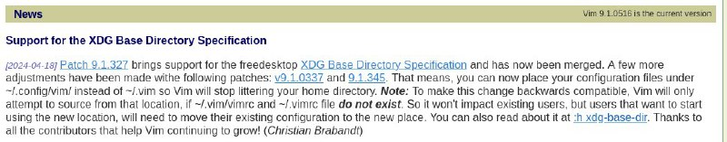

+++
title = "I moved /.vim to /.config/vim, you also can"
date = 2024-07-02T22:12:00+00:00

[extra]
tg_url = "https://t.me/vitaly_zdanevich_chan/86"
og_image = "5197437665916610129_1210122757_456255057.jpg"
next_id = 87
next_title = "Wow gitlab has a cron..."
prev_id = 85
prev_title = "Good design caddy"
views = 63
ids = [86]
+++

