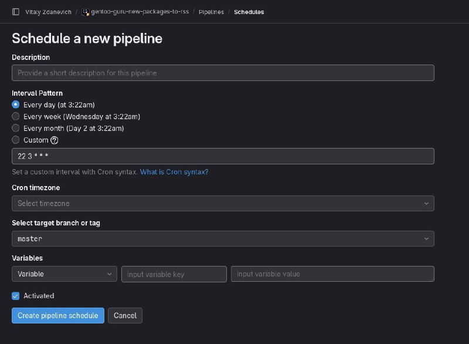

+++
title = ""
date = 2024-07-10T13:10:02+00:00
description = "Wow gitlab has a cron..."

[taxonomies]
days = ["2024-07-10"]
tags = ["gitlab", "cron"]

[extra]
id = 87
day = "2024-07-10"
tg_url = "https://t.me/vitaly_zdanevich_chan/87"
og_image = "5219778561077009585_1215324402_456252593.jpg"
next_id = 88
next_title = ""
prev_id = 86
prev_title = ""
views = 51
ids = [87]
+++

Wow {{ tag(t="gitlab") }} has a {{ tag(t="cron") }}...

