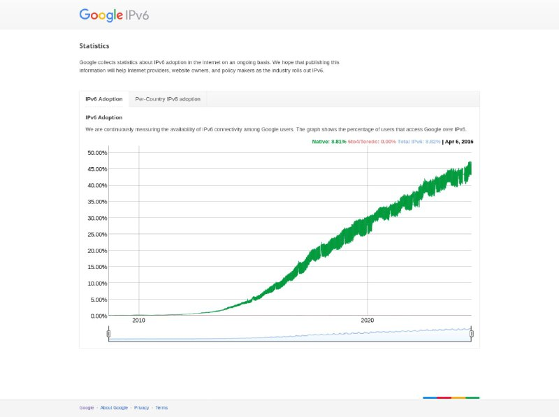

+++
title = ""
date = 2024-07-21T07:54:32+00:00
description = "ipv6"

[taxonomies]
days = ["2024-07-21"]
tags = ["ipv6"]

[extra]
id = 93
day = "2024-07-21"
tg_url = "https://t.me/vitaly_zdanevich_chan/93"
og_image = "5253747019334409094_1223233300_456252294.jpg"
next_id = 94
next_title = ""
prev_id = 92
prev_title = ""
views = 54
ids = [93]
+++

<https://www.google.com/intl/en/ipv6/statistics.html#tab=ipv6-adoption>  

{{ tag(t="ipv6") }}

