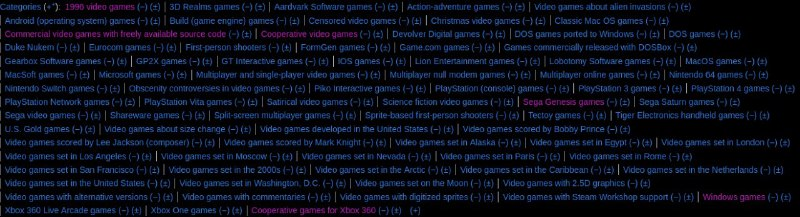

+++
title = ""
date = 2024-08-28T09:36:47+00:00
description = "Categories"

[taxonomies]
days = ["2024-08-28"]

[extra]
id = 139
day = "2024-08-28"
tg_url = "https://t.me/vitaly_zdanevich_chan/139"
og_image = "5366491319603683533_1249483628_456253645.jpg"
next_id = 140
next_title = ""
next_body = "Moss: Book 2: one of the best VR game. I played on Meta Quest 2. And here - one of the most dramatic episode of the game industry. Usual gameplay is interrupted by painful death of the main character. So lovely animation. So much of love and pain. She is asking the player to help - but we cannot help, she is crying. Another book. Another hero - who does not like you.\nIn VR it more dramatic, real. I love VR games.\nI cut the video fragment from"
prev_id = 138
prev_title = ""
prev_body = "Played yesterday of Moss: Book 2 in Quest 2 - great VR, great game."
views = 54
ids = [139]
+++

[Categories](https://en.wikipedia.org/wiki/Duke_Nukem_3D)

