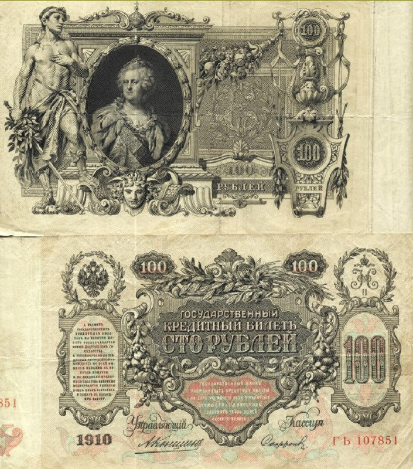

+++
title = ""
date = 2024-08-31T05:26:35+00:00
description = "1910 Russian Empire 100 rubles bill with Tzar Catherina portrait money"

[taxonomies]
days = ["2024-08-31"]
tags = ["money"]

[extra]
id = 141
day = "2024-08-31"
tg_url = "https://t.me/vitaly_zdanevich_chan/141"
og_image = "5373261446487598673_1251059921_456255057.jpg"
next_id = 142
next_title = ""
next_body = "#pupups"
prev_id = 140
prev_title = ""
prev_body = "Moss: Book 2: one of the best VR game. I played on Meta Quest 2. And here - one of the most dramatic episode of the game industry. Usual gameplay is interrupted by painful death of the main character. So lovely animation. So much of love and pain. She is asking the player to help - but we cannot help, she is crying. Another book. Another hero - who does not like you.\nIn VR it more dramatic, real. I love VR games.\nI cut the video fragment from"
views = 57
ids = [141]
+++

> 1910 Russian Empire 100 rubles bill with Tzar Catherina portrait

<https://commons.wikimedia.org/wiki/File:RU-Katarzyna-100rubli-1910.jpg>  

{{ tag(t="money") }}

