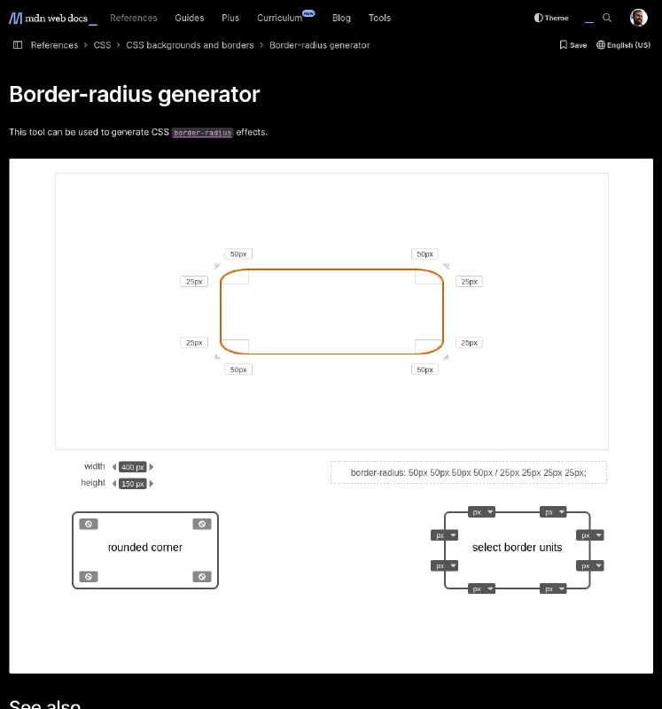

+++
title = ""
date = 2024-11-01T22:30:53+00:00
description = "Wow border-radius generator, so many values"

[taxonomies]
days = ["2024-11-01"]

[extra]
id = 174
day = "2024-11-01"
tg_url = "https://t.me/vitaly_zdanevich_chan/174"
og_image = "5271829222492594981_1227443391_456254245.jpg"
next_id = 175
next_title = ""
next_body = "#web3 audio platform, #opensource, on #ipfs, I uploaded #complexnumbers to it"
prev_id = 173
prev_title = ""
prev_body = ""
views = 35
ids = [174]
+++

Wow `border-radius` generator, so many values <https://developer.mozilla.org/en-US/docs/Web/CSS/CSS_backgrounds_and_borders/Border-radius_generator>

