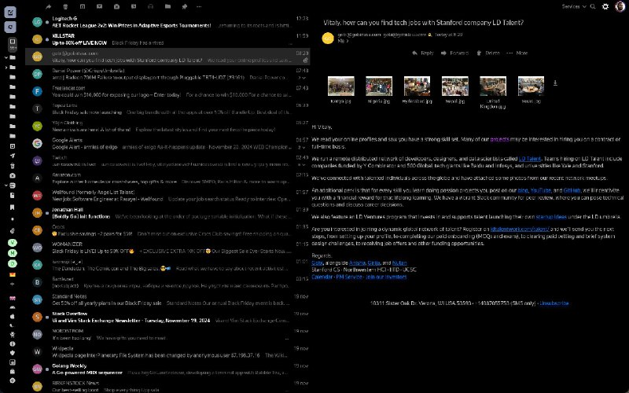

+++
title = ""
date = 2024-11-20T09:12:29+00:00
description = "style love my custom YandexMail"

[taxonomies]
days = ["2024-11-20"]
tags = ["style"]

[extra]
id = 195
day = "2024-11-20"
tg_url = "https://t.me/vitaly_zdanevich_chan/195"
og_image = "5325686926973462534_1239983115_456255494.jpg"
next_id = 196
next_title = ""
next_body = "#space\n#film #extract Lost in Space) from 1998, movie ending, love it\n#lostinspace"
prev_id = 194
prev_title = ""
prev_body = "About games preservation"
views = 40
ids = [195]
+++

{{ tag(t="style") }} love my custom YandexMail <https://gitlab.com/vitaly-zdanevich-styles/yandex-mail>

