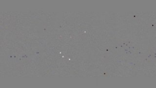

+++
title = ""
date = 2024-11-20T12:51:37+00:00
description = "space film extract Lost in Space) from 1998, movie ending, love it lostinspace"

[taxonomies]
days = ["2024-11-20"]
tags = ["space", "film", "extract", "lost_in_space"]

[extra]
id = 196
day = "2024-11-20"
tg_url = "https://t.me/vitaly_zdanevich_chan/196"
og_image = "01.jpg"
next_id = 197
next_title = ""
next_body = "From , ending"
prev_id = 195
prev_title = ""
prev_body = "#style love my custom YandexMail"
views = 54
ids = [196]

[[extra.related]]
path = "@/posts/2025-05-06-500/index.md"
label = "#film #jupiter #space"

[[extra.related]]
path = "@/posts/2025-01-17-253/index.md"
label = "#film #scifi #space"

[[extra.related]]
path = "@/posts/2024-02-26-32/index.md"
label = "#film Love, Sex & Robots S1.E3: The Witness"

[[extra.related]]
path = "@/posts/2025-11-13-778/index.md"
label = "#film #kindzadza Гамарджоба At 1:50:00"

[[extra.related]]
path = "@/posts/2025-10-03-696/index.md"
label = "#film #scifi Love, Death & Robots: fan mashup of s1ep7 Beyond th…"
+++

{{ tag(t="space") }}  
{{ tag(t="film") }} {{ tag(t="extract") }} [Lost in Space](https://en.wikipedia.org/wiki/Lost_in_Space_(film)) from 1998, movie ending, love it  
{{ tag(t="lost_in_space") }}

*▶ video — 32:37*
