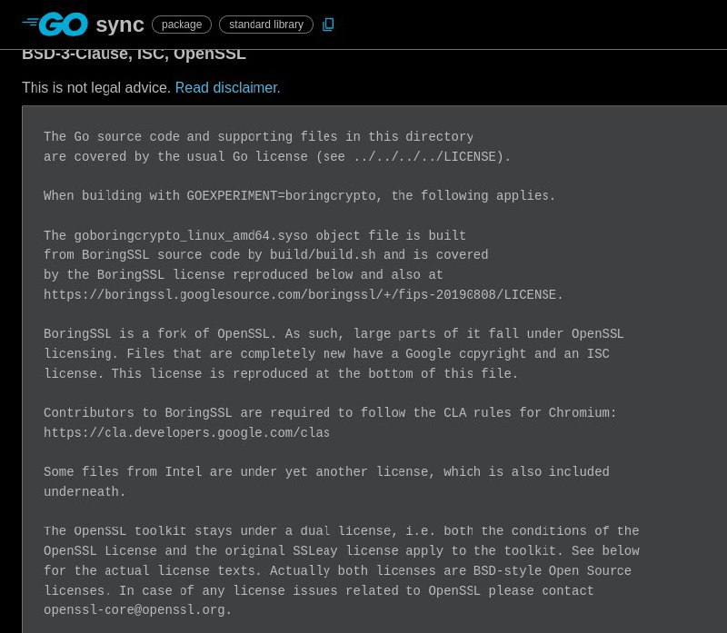

+++
title = "license"
date = 2024-12-03T08:15:53+00:00
description = "license"

[taxonomies]
tags = ["license"]

[extra]
tg_url = "https://t.me/vitaly_zdanevich_chan/209"
og_image = "5366158232004978363_1249406075_456255163.jpg"
next_id = 210
next_title = "Reminder about data preservation"
prev_id = 208
prev_title = "About games archiving"
views = 41
ids = [209]
+++

{{ tag(t="license") }}
<https://pkg.go.dev/sync?tab=licenses>

