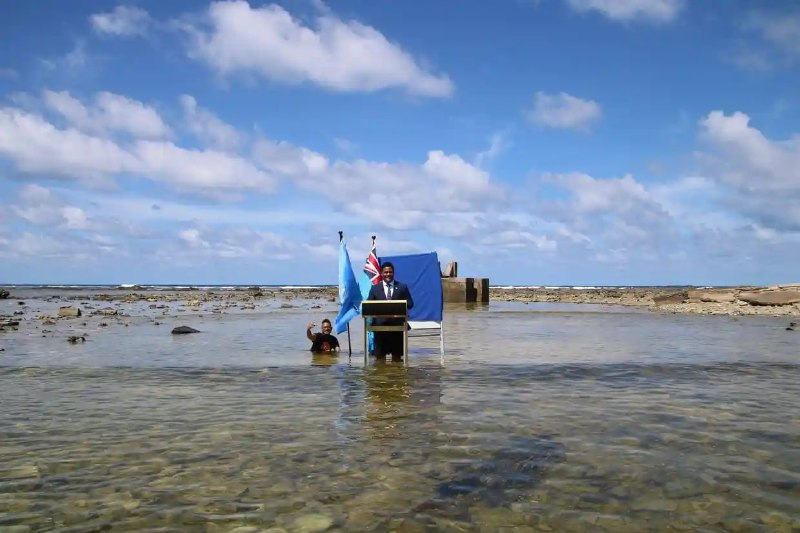

+++
title = ""
date = 2024-12-23T13:43:43+00:00
description = "Цифровой двойник для сохранения государства и культуры Тувалу Небольшое государство Тувалу, расположенное на тихоокеанских островах, находится на грани исчезновения. Это происходит из-за…"

[taxonomies]
days = ["2024-12-23"]

[extra]
id = 223
day = "2024-12-23"
tg_url = "https://t.me/vitaly_zdanevich_chan/223"
og_image = "5276262517800291116_1228475598_456248108.jpg"
next_id = 224
next_title = ""
next_body = "#game #ui #pathofexile2"
prev_id = 222
prev_title = ""
prev_body = "#youtube"
views = 44
forwarded_from = "Национальный цифровой архив"
forwarded_from_url = "https://t.me/ruarxive/107"
ids = [223]
+++

**Цифровой двойник для сохранения государства и культуры Тувалу** Небольшое государство Тувалу, расположенное на тихоокеанских островах, находится на грани исчезновения. Это происходит из-за климатических изменений, повышающих уровень воды.  

Столкнувшись с угрозой утраты собственной культурной самобытности, правительство решило создать цифровой двойник государства.  

Проходят оцифровку документы, сохраняются фото, 3D модели и геопространственные данные географических объектов и ландшафта, доступ к государственным услугам и всем сопутствующим административным системам переводится в облако. Помимо этого, возможно использование дополненной и виртуальной реальности, чтобы позволить будущим поколениям тувалуанцев продолжать существовать как культура и нация, сохранить общий язык и обычаи предков.  

Источник: [The Guardian](https://www.theguardian.com/world/2023/jun/27/tuvalu-climate-crisis-rising-sea-levels-pacific-island-nation-country-digital-clone?utm_campaign=The%20Week%20in%20Data%20TWID&amp;utm_medium=email&amp;utm_content=264626528&amp;utm_source=hs_email)*Фото: Kofe gives a Cop26 statement while standing in the ocean in Funafuti in November 2021. Photograph: Tuvalu Foreign Ministry/Reuters*

