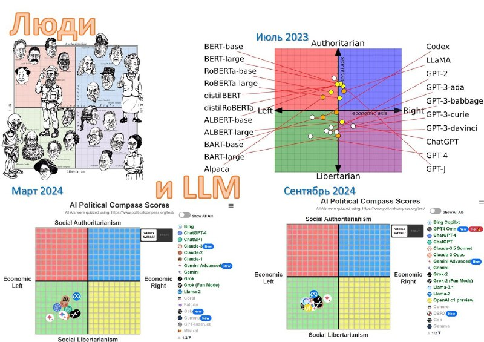

+++
title = ""
date = 2025-01-01T06:40:04+00:00
description = "Лево-либеральная пропасть стала еще ближе В марте 2023 я опубликовал прогноз неотвратимости полевения мира под влиянием пристрастий ИИ-чатботов. В пользу прогноза тогда были лишь данные одного…"

[taxonomies]
days = ["2025-01-01"]
tags = ["LLM", "КогнитивныеИскажения", "ПолитическаяПредвзятость"]

[extra]
id = 238
day = "2025-01-01"
tg_url = "https://t.me/vitaly_zdanevich_chan/238"
og_image = "5429357657858367725_1264120838_456253677.jpg"
next_id = 239
next_title = ""
next_body = ""
prev_id = 237
prev_title = ""
prev_body = "#ai"
views = 48
forwarded_from = "Малоизвестное интересное"
forwarded_from_url = "https://t.me/theworldisnoteasy/2010"
ids = [238]
+++

**Лево-либеральная пропасть стала еще ближе**  
В марте 2023 я опубликовал [прогноз неотвратимости полевения мира](https://t.me/theworldisnoteasy/1681) под влиянием пристрастий ИИ-чатботов. В пользу прогноза тогда были лишь данные одного ChatGPT лишь за 3 месяца работы.  
Но к марту 2024 данных стало много, и точки над i были расставлены: увы, мой прогноз сбылся (о чем был написан лонгрид «[Пандемия либерального полевения](https://t.me/theworldisnoteasy/1918)»)  

Однако время все продолжает ускоряться.  
И с марта ИИ-чатботы поумнели больше, чем за предыдущую пару лет, подойдя к уровню аспирантов и IQ в районе 120.  

Поэтому есть смысл  
•  проверить, как ведет себя глобальный тренд усиления лево-либеральности ИИ-чатботов;  
•  сравнить степень их лево-либеральности;  
•  и оценить динамику усугубления их политических, экономических и социальных предубеждений.  

Резюме на картинке – **все становится только хуже и хуже** (подробности [здесь](https://trackingai.org/)).  
***✔️** Люди за пару тысяч лет сохранили разнообразие взглядов  
**✔️** LLM за пару лет выродились в крайне левых либералов*  

{{ tag(t="LLM") }} {{ tag(t="КогнитивныеИскажения") }} {{ tag(t="ПолитическаяПредвзятость") }}

