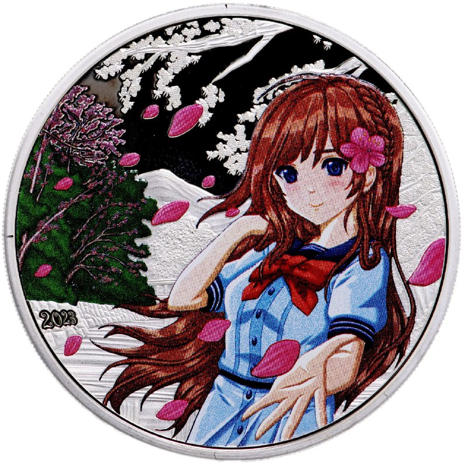

+++
title = "coin"
date = 2025-02-15T01:31:57+00:00
description = "coin Source"

[taxonomies]
tags = ["coin"]

[extra]
tg_url = "https://t.me/vitaly_zdanevich_chan/361"
og_image = "5296425538124113913_1233170167_456255481.jpg"
next_id = 362
next_title = "Its real coins, from Cook Islands"
prev_id = 360
prev_title = "religion"
views = 39
ids = [361]
+++

{{ tag(t="coin") }}

[Source](https://www.monetnik.ru/monety/mira/avstraliya-i-okeaniya/ostrova-kuka/ostrova-kuka-5-dollarov-583633/#group=nogroup&amp;photo=0)

