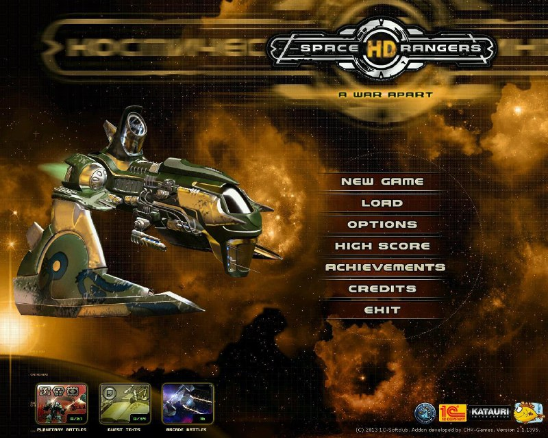

+++
title = ""
date = 2025-02-26T02:58:30+00:00
description = "Прывiтаначкi, я пачаў афiцыйны пераклад знакамiтай кампутарнай гульнi Space Rangers (з расейскай) - мова будзе адразу iнтэгравана ў Steam. Калi ласка дапамажыце, ня думаю што мая мова добрая.…"

[taxonomies]
days = ["2025-02-26"]

[extra]
id = 380
day = "2025-02-26"
tg_url = "https://t.me/vitaly_zdanevich_chan/380"
og_image = "5325658489994995451_1239976494_456255227.jpg"
next_id = 381
next_title = ""
prev_id = 379
prev_title = ""
views = 90
forwarded_from = "Vitaly Zdanevich"
forwarded_from_url = "https://t.me/vitaly_zdanevich"
ids = [380]
+++

Прывiтаначкi, я пачаў **афiцыйны** пераклад знакамiтай кампутарнай гульнi [Space Rangers](https://store.steampowered.com/app/214730/Space_Rangers_HD_A_War_Apart) (з расейскай) - мова будзе адразу iнтэгравана ў Steam. Калi ласка дапамажыце, ня думаю што мая мова добрая.  

Перакладаць будзем тут <https://gitlab.com/vitaly-zdanevich/space-rangers-to-be>  
Стварыце там аккаунт, я адкрыт для дапамогi, калi там нешта незразумела.  

Там таксама i крыху аудыя, можа гэта я ужо сам, паглядзiм. Яшчэ ў канцы ёсць [песня пра космас](https://youtu.be/q3gWi7ATybk) - калi хто жадае спець :)  

Калi ласка перашлiце гэта тым хто быць можа зацiкаўлены.  

Аб гульне <https://www.youtube.com/watch?v=P6j3WWh7Yc8>

{{ youtube(id="q3gWi7ATybk") }}

