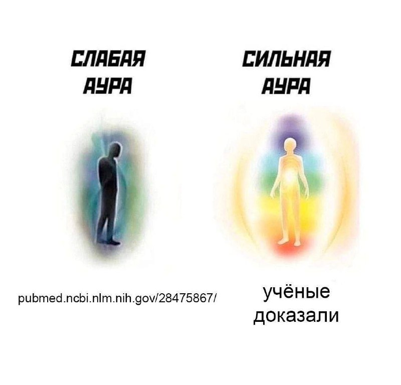

+++
title = ""
date = 2025-03-13T18:05:11+00:00
description = "health pubmed aura Source"

[taxonomies]
days = ["2025-03-13"]
tags = ["health", "pubmed", "aura"]

[extra]
id = 405
day = "2025-03-13"
tg_url = "https://t.me/vitaly_zdanevich_chan/405"
og_image = "5375405086139870428_1251559026_456256732.jpg"
next_id = 406
next_title = ""
next_body = "#health\n#science\n#references\n#source\n#walk\n#chad"
prev_id = 404
prev_title = ""
prev_body = "#video\n#ad\n#japan\n#ai\n#girl\n#virtual\nSource"
views = 35
ids = [405]
+++

{{ tag(t="health") }}  
{{ tag(t="pubmed") }}  
{{ tag(t="aura") }}  

[Source](https://x.com/ArseniosMarkos/status/1837373989724856393)

