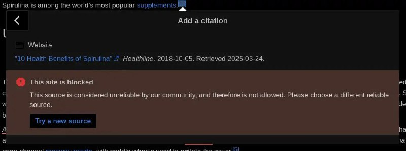

+++
title = ""
date = 2025-03-24T00:16:12+00:00
description = "On Wikipedia, not all websites can be used as sources. Every fact on Wikipedia must have a reliable source. Original research is not allowed — Wikipedia only summarizes facts from trusted, reputable…"

[taxonomies]
days = ["2025-03-24"]
tags = ["Wikipedia"]

[extra]
id = 441
day = "2025-03-24"
tg_url = "https://t.me/vitaly_zdanevich_chan/441"
og_image = "5406954455607405557_1258904686_456256501.jpg"
next_id = 442
next_title = ""
next_body = "wow in #telegram we have a #crypto #wallet, and users can send money to their contacts, wow"
prev_id = 440
prev_title = ""
prev_body = "#music\n#car\nMick Gordon - BFG division from #doom3\nSource"
views = 34
ids = [441]
+++

On {{ tag(t="Wikipedia") }}, not all websites can be used as sources.  

Every fact on Wikipedia must have a reliable source. Original research is not allowed — Wikipedia only summarizes facts from trusted, reputable places.

