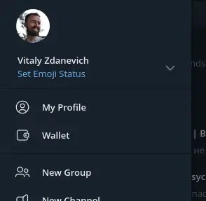

+++
title = ""
date = 2025-03-24T00:23:35+00:00
description = "wow in telegram we have a crypto wallet, and users can send money to their contacts, wow"

[taxonomies]
days = ["2025-03-24"]
tags = ["telegram", "crypto", "wallet"]

[extra]
id = 442
day = "2025-03-24"
tg_url = "https://t.me/vitaly_zdanevich_chan/442"
og_image = "01.jpg"
next_id = 444
next_title = ""
next_body = "#monetization\n#spyware\n#security\n#webextension"
prev_id = 441
prev_title = ""
prev_body = "On #Wikipedia, not all websites can be used as sources.\nEvery fact on Wikipedia must have a reliable source. Original research is not allowed — Wikipedia only summarizes facts from trusted, reputable places."
views = 30
ids = [442]
+++

wow in {{ tag(t="telegram") }} we have a {{ tag(t="crypto") }} {{ tag(t="wallet") }}, and users can send money to their contacts, wow

