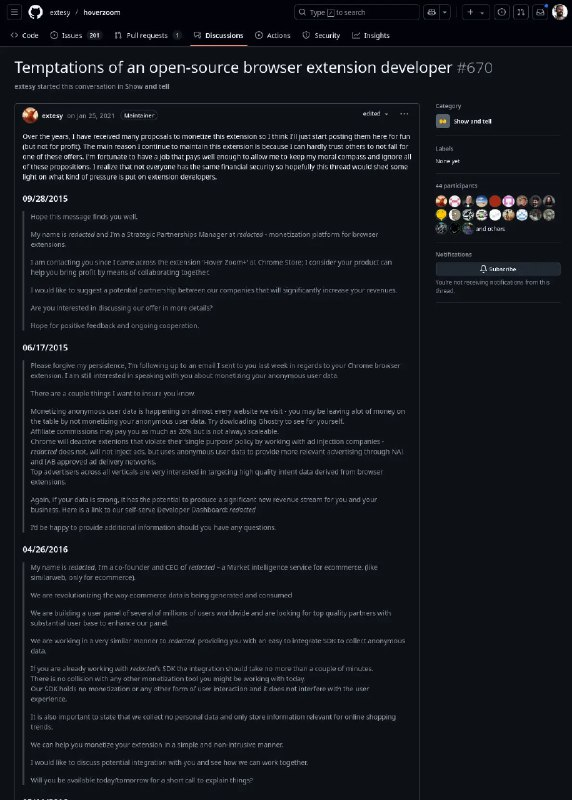

+++
title = "monetization spyware security webextension"
date = 2025-03-24T03:11:11+00:00
description = "monetization spyware security webextension"

[taxonomies]
tags = ["monetization", "spyware", "security", "webextension"]

[extra]
tg_url = "https://t.me/vitaly_zdanevich_chan/444"
og_image = "5406954455607405651_1258904686_456256595.jpg"
next_id = 445
next_title = "elon_musk star_wars elections roman_salute video"
prev_id = 442
prev_title = "wow in telegram we have a crypto wallet, and users can send money to their contacts, wow"
views = 33
ids = [444]
+++

{{ tag(t="monetization") }}
{{ tag(t="spyware") }}
{{ tag(t="security") }}
{{ tag(t="webextension") }}

<https://github.com/extesy/hoverzoom/discussions/670>

