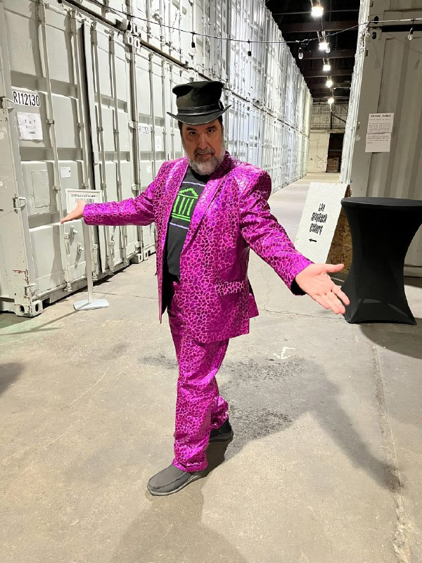

+++
title = ""
date = 2025-04-18T03:53:24+00:00
description = "archiving preservation internetarchive jasonscott man hat harddrives Jason Scott, Internet Archive employee, photo in color From"

[taxonomies]
days = ["2025-04-18"]
tags = ["archiving", "preservation", "internet_archive", "jason_scott", "man", "hat", "hard_drives"]

[extra]
id = 474
day = "2025-04-18"
tg_url = "https://t.me/vitaly_zdanevich_chan/474"
og_image = "5192688952505658006_1209017111_456256150.jpg"
next_id = 475
next_title = ""
next_body = "#podcast 004 З Уладзімерам Русаковічам: стварыў 1740 артыкулаў у Вiкiпэдыi\nШто такое левыя і правае?\nWikidata запыт - беларускія пісьменнікі памерлыя 50 гадоў таму\nМая чорная тэма\nUserscripts\nПавінна быць у Вікісховішчы, магчыма ўжо запампавана\nАдсканавана макс 5% старых дакументаў\nШукаем перакладчыкаў для Касмічных Рейндажаў 2\nСпіс гульняў з беларускай мовай\nМой мікрафон: Shure BETA 58A з Scarlett Solo 3rd Gen\nУладзiмер пicаўся праз Telegram гаворачы ў мікрафон свайго лаптопа MS-1552\nПiсалiся i рэдактура: Gentoo Linux, Audacity, ffmpeg audio grabbing\nffmpeg\n-f pulse -i alsaoutput.usb-FocusriteScarlettSoloUSBY7D1J3F0A66336-00.DirectDirectsink.monitor\n-c:a flac\n-ac 1\n/record/out/$(date +%Y-%b-%d%a--%H-%M-%S | tr A-Z a-z).flac\n# Press q to finish the recording.\n# Devices from pacmd list-sources | grep -e 'name:' -e 'index:'\nЁсць што сказаць ці запытаць?\nКантакт Уладзіміра"
prev_id = 473
prev_title = ""
prev_body = "#valve\n#hl2\n#rip"
views = 55
ids = [474]
+++

{{ tag(t="archiving") }}  
{{ tag(t="preservation") }}  
{{ tag(t="internet_archive") }}  
{{ tag(t="jason_scott") }}  
{{ tag(t="man") }}  
{{ tag(t="hat") }}  
{{ tag(t="hard_drives") }}  

Jason Scott, Internet Archive employee, photo in color  

From <https://x.com/textfiles/status/1850987321052578168/photo/1>

