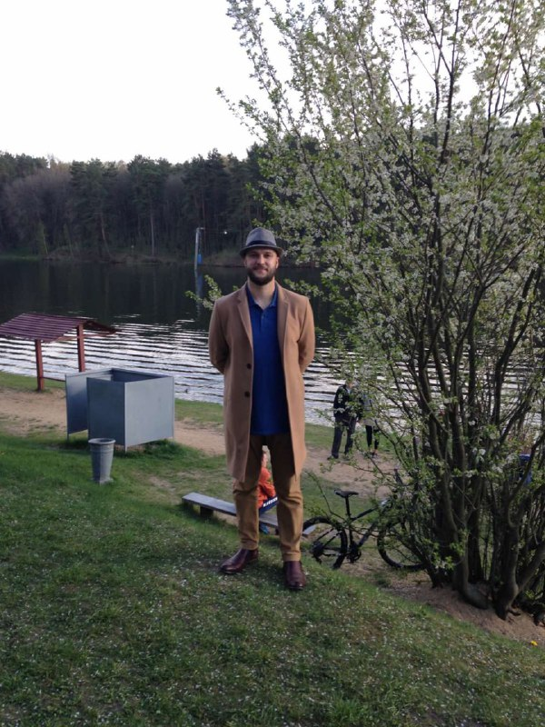

+++
title = "Artwork for the podcast"
date = 2025-04-19T15:31:01+00:00

[extra]
tg_url = "https://t.me/vitaly_zdanevich_chan/478"
og_image = "5197547561244816487_1210148344_456258663.jpg"
next_id = 479
next_title = "I wrote."
prev_id = 475
prev_title = "podcast 004 З Уладзімерам Русаковічам: стварыў 1740 артыкулаў у Вiкiпэдыi"
views = 56
ids = [478]
+++

