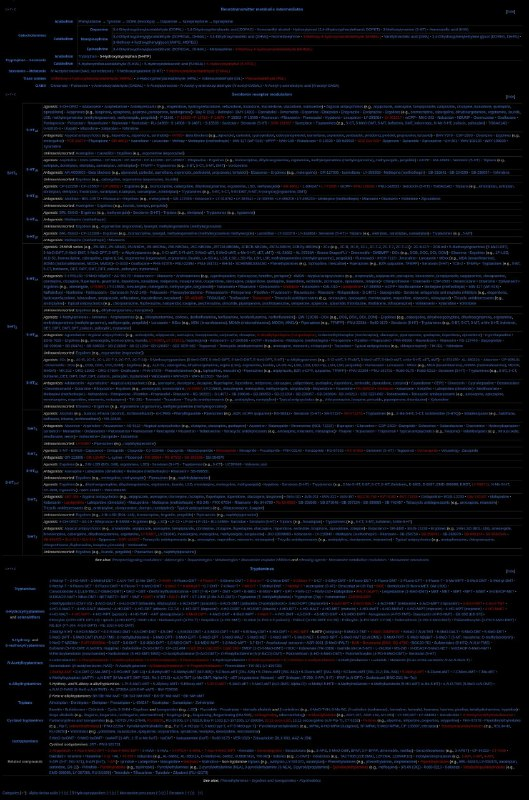

+++
title = "wikipedia ui navigation"
date = 2025-05-04T01:29:49+00:00
description = "wikipedia ui navigation"

[taxonomies]
tags = ["wikipedia", "ui", "navigation"]

[extra]
tg_url = "https://t.me/vitaly_zdanevich_chan/496"
og_image = "5240482558301564465_1220144927_456257073.jpg"
next_id = 497
next_title = "compression xz zstd lz4 zlib meta"
prev_id = 495
prev_title = "2025-05-03 21:36"
views = 26
ids = [496]
+++

{{ tag(t="wikipedia") }}
{{ tag(t="ui") }}
{{ tag(t="navigation") }}

