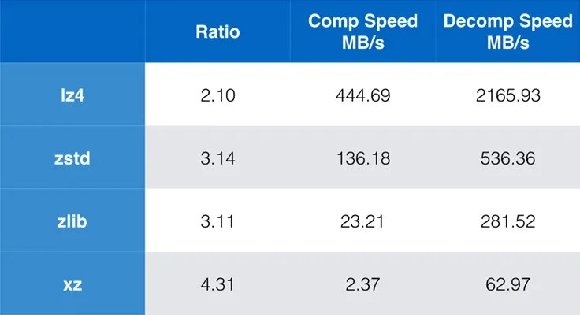

+++
title = "compression xz zstd lz4 zlib meta"
date = 2025-05-05T16:51:23+00:00
description = "compression xz zstd lz4 zlib meta Source"

[taxonomies]
tags = ["compression", "xz", "zstd", "lz4", "zlib", "meta"]

[extra]
tg_url = "https://t.me/vitaly_zdanevich_chan/497"
og_image = "5244618822261012731_1221107976_456259835.jpg"
next_id = 498
next_title = "2025-05-05 17:02"
prev_id = 496
prev_title = "wikipedia ui navigation"
views = 23
ids = [497]
+++

{{ tag(t="compression") }}
{{ tag(t="xz") }}
{{ tag(t="zstd") }}
{{ tag(t="lz4") }}
{{ tag(t="zlib") }}
{{ tag(t="meta") }}

[Source](https://engineering.fb.com/2016/08/31/core-infra/smaller-and-faster-data-compression-with-zstandard)

