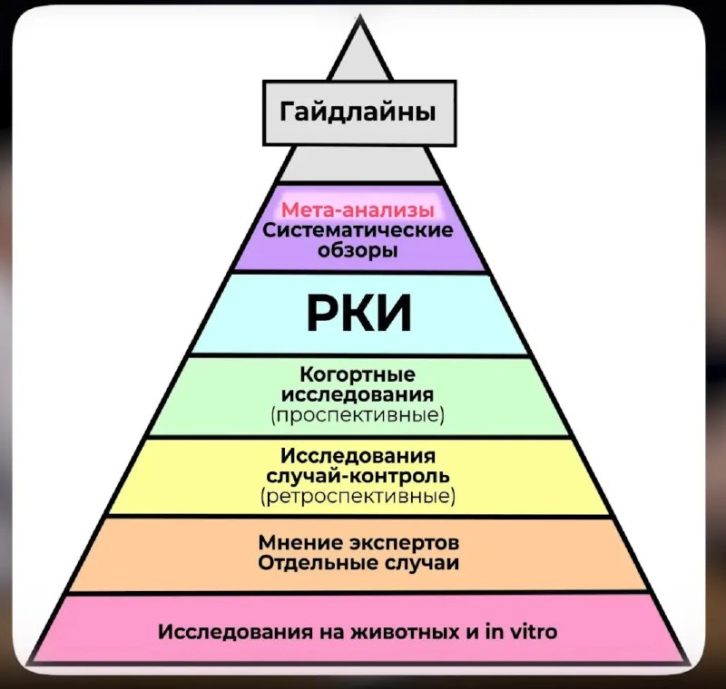

+++
title = "health science"
date = 2025-05-08T18:23:25+00:00
description = "health science"

[taxonomies]
tags = ["health", "science"]

[extra]
tg_url = "https://t.me/vitaly_zdanevich_chan/509"
og_image = "5251285917174461941_1222660280_456259061.jpg"
next_id = 510
next_title = "For example portable git in a single file"
prev_id = 508
prev_title = "wifi child autism sick health"
views = 22
ids = [509]
+++

{{ tag(t="health") }}
{{ tag(t="science") }}

