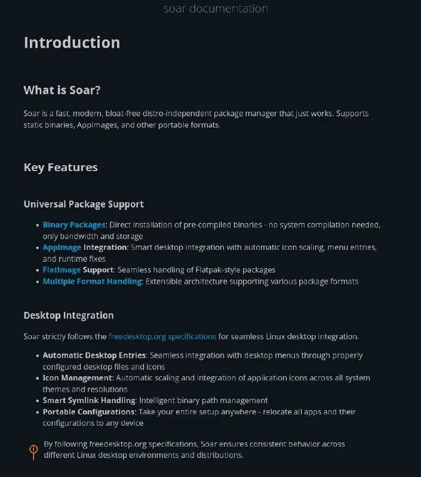
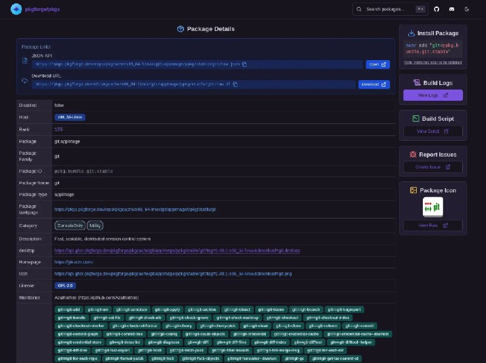

+++
title = ""
date = 2025-05-09T00:35:27+00:00
description = "packagemanager appimage For example portable git in a single file"

[taxonomies]
days = ["2025-05-09"]
tags = ["package_manager", "appimage", "git"]

[extra]
id = 510
day = "2025-05-09"
tg_url = "https://t.me/vitaly_zdanevich_chan/510"
og_image = "01.jpg"
next_id = 512
next_title = ""
prev_id = 509
prev_title = ""
views = 23
ids = [510]
+++

{{ tag(t="package_manager") }}
{{ tag(t="appimage") }}

[https://soar.qaidvoid.dev](https://soar.qaidvoid.dev/)

For example portable {{ tag(t="git") }} in a single file <https://pkgs.pkgforge.dev/repo/pkgcache/x86_64-linux/git/appimage/ppkg/stable/git>

