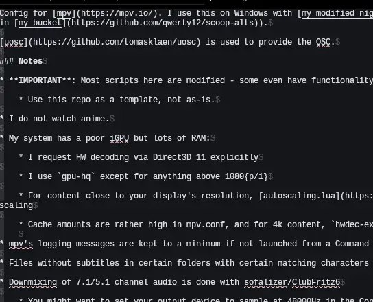

+++
title = "mpv anime readme"
date = 2025-05-10T01:25:12+00:00
description = "mpv anime readme"

[taxonomies]
tags = ["mpv", "anime", "readme"]

[extra]
tg_url = "https://t.me/vitaly_zdanevich_chan/512"
og_image = "5258181706211520084_1224265831_456257108.jpg"
next_id = 513
next_title = "bilibili anime webdesign stream ui"
prev_id = 510
prev_title = "For example portable git in a single file"
views = 20
ids = [512]
+++

{{ tag(t="mpv") }}
{{ tag(t="anime") }}
{{ tag(t="readme") }}

