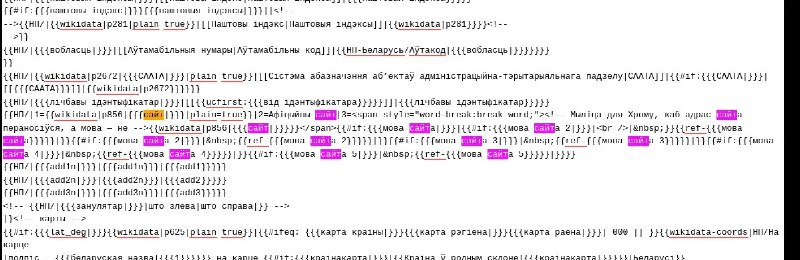

+++
title = "Wikipedia templates"
date = 2025-05-12T17:50:15+00:00
description = "code wikipedia"

[taxonomies]
tags = ["code", "wikipedia"]

[extra]
tg_url = "https://t.me/vitaly_zdanevich_chan/522"
og_image = "5264726708089648938_1225789708_456259370.jpg"
next_id = 523
next_title = "belarus history lost offline"
prev_id = 521
prev_title = "Dream setup."
views = 28
ids = [522]
+++

{{ tag(t="code") }}
{{ tag(t="wikipedia") }}

[https://be.wikipedia.org/w/index.php?title=Шаблон:НП-Беларусь&action=edit](https://be.wikipedia.org/w/index.php?title=%D0%A8%D0%B0%D0%B1%D0%BB%D0%BE%D0%BD:%D0%9D%D0%9F-%D0%91%D0%B5%D0%BB%D0%B0%D1%80%D1%83%D1%81%D1%8C&action=edit)

