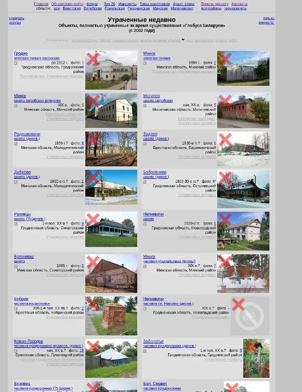

+++
title = "belarus history lost offline"
date = 2025-05-12T18:26:44+00:00
description = "belarus history lost offline"

[taxonomies]
tags = ["belarus", "history", "lost", "offline"]

[extra]
tg_url = "https://t.me/vitaly_zdanevich_chan/523"
og_image = "5264726708089649051_1225789708_456259483.jpg"
next_id = 524
next_title = "2025-05-13 01:36"
prev_id = 522
prev_title = "Wikipedia templates"
views = 32
ids = [523]
+++

{{ tag(t="belarus") }}
{{ tag(t="history") }}
{{ tag(t="lost") }}
{{ tag(t="offline") }}

<https://globustut.by/type_tn_lost.htm?s=-fullobject>

