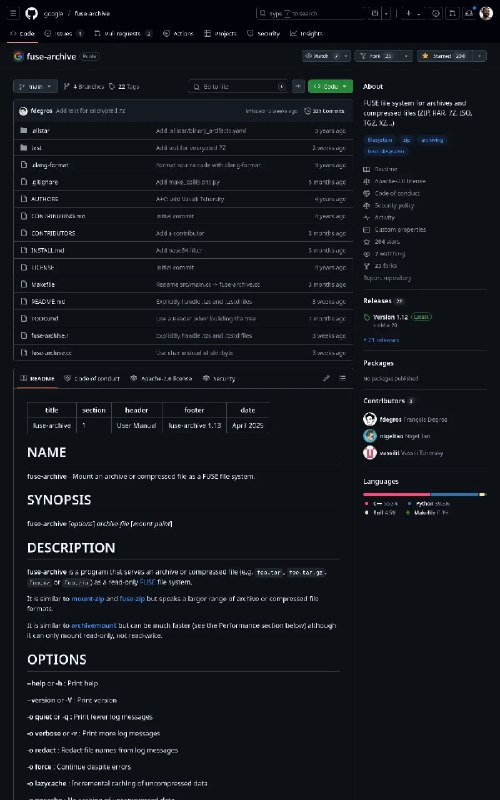

+++
title = ""
date = 2025-05-14T01:47:37+00:00
description = "mount archive (zip, rar and others) as read-only fuse, love it fuse-archive f.rar /mnt/"

[taxonomies]
days = ["2025-05-14"]
tags = ["mount", "archive", "zip", "rar", "fuse"]

[extra]
id = 528
day = "2025-05-14"
tg_url = "https://t.me/vitaly_zdanevich_chan/528"
og_image = "5269656982653106298_1226937627_456259706.jpg"
next_id = 529
next_title = ""
prev_id = 527
prev_title = ""
views = 37
ids = [528]
+++

{{ tag(t="mount") }} {{ tag(t="archive") }} ({{ tag(t="zip") }}, {{ tag(t="rar") }} and others) as read-only {{ tag(t="fuse") }}, love it

`fuse-archive f.rar ~/mnt/`

<https://github.com/google/fuse-archive>

