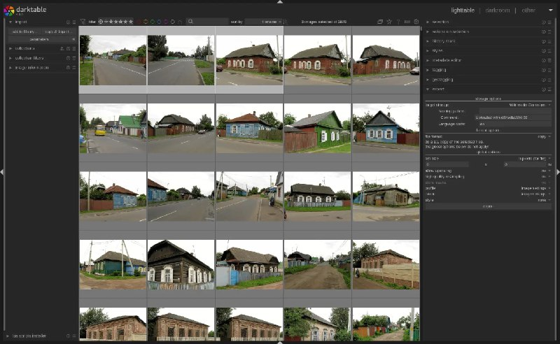

+++
title = "You can upload to commons through darktable with this free plugin"
date = 2025-05-14T05:27:06+00:00
description = "You can upload to commons through darktable with this free plugin"

[taxonomies]
tags = ["upload", "commons", "darktable"]

[extra]
tg_url = "https://t.me/vitaly_zdanevich_chan/530"
og_image = "5269559087463524741_1226914834_456255877.jpg"
next_id = 531
next_title = "Buildings in Babruysk"
prev_id = 529
prev_title = "gentoo patches"
views = 40
ids = [530]
+++

You can {{ tag(t="upload") }} to {{ tag(t="commons") }} through {{ tag(t="darktable") }} with this [free plugin](https://github.com/trougnouf/dtMediaWiki)

