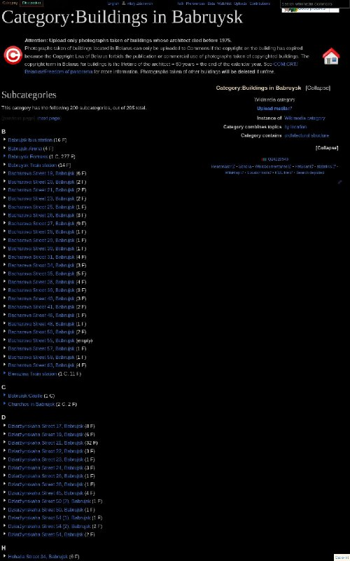

+++
title = "Buildings in Babruysk"
date = 2025-05-14T05:43:58+00:00
description = "Buildings in Babruysk"

[extra]
tg_url = "https://t.me/vitaly_zdanevich_chan/531"
og_image = "5269656982653106475_1226937627_456259883.jpg"
next_id = 532
next_title = "From globustut.by"
prev_id = 530
prev_title = "You can upload to commons through darktable with this free plugin"
views = 43
ids = [531]
+++

[Buildings in Babruysk](https://commons.wikimedia.org/wiki/Category:Buildings_in_Babruysk)

