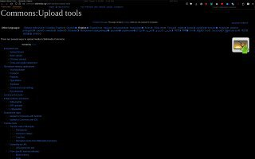

+++
title = ""
date = 2025-05-22T13:51:30+00:00
description = "Wikimedia Commons: загрузка через мой Python скрипт через gThumb, и немного про dtMediaWiki для Darktable video my commons Репозиторий этого моего нового скрипта Мои скрипты, для Википедии и прочего…"

[taxonomies]
days = ["2025-05-22"]
tags = ["video", "my", "commons"]

[extra]
id = 538
day = "2025-05-22"
tg_url = "https://t.me/vitaly_zdanevich_chan/538"
og_image = "01.jpg"
next_id = 539
next_title = ""
prev_id = 537
prev_title = ""
views = 46
ids = [538]
+++

**Wikimedia Commons: загрузка через мой Python скрипт через gThumb, и немного про dtMediaWiki для Darktable**

{{ tag(t="video") }}
{{ tag(t="my") }}
{{ tag(t="commons") }}

Репозиторий этого моего нового скрипта <https://gitlab.com/vitaly-zdanevich/upload-to-commons-with-categories-from-iptc>

Мои скрипты, для Википедии и прочего <https://gitlab.com/vitaly-zdanevich-userscripts>

Мои темы <https://gitlab.com/vitaly-zdanevich-styles>

Моя тема для Википедии <https://github.com/vitaly-zdanevich/wikipedia-userstyle-dark-minimum>

<https://gitlab.com/vitaly-zdanevich-configs/firefox-profile/-/blob/936cb964f3ee78bb91b0f5adbbe0a9be8cc3ff0c/chrome/userContent.css>

<https://commons.wikimedia.org/wiki/Commons:Upload_tools>

Мой тикет про segmentation fault <https://github.com/darktable-org/darktable/issues/18819>

Моя тема для Darktable <https://gitlab.com/vitaly-zdanevich-configs/darktable/-/blob/master/user.css>

Плагин для загрузки в Wikipedia Commons для Darktable <https://github.com/trougnouf/dtMediaWiki>

*▶ video — 40:24*
