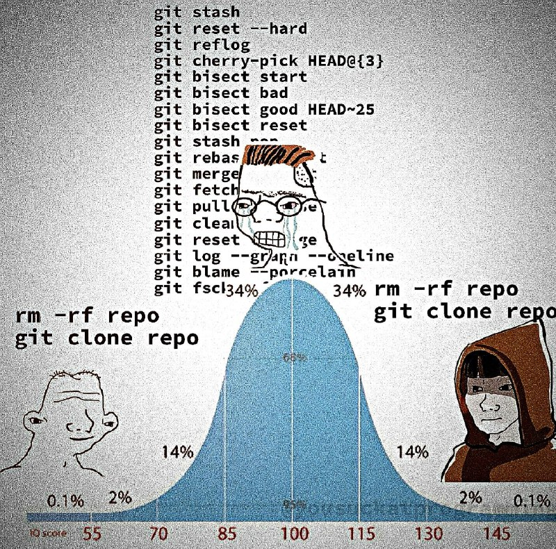

+++
title = ""
date = 2025-05-27T20:28:44+00:00
description = "git Source"

[taxonomies]
days = ["2025-05-27"]
tags = ["git"]

[extra]
id = 542
day = "2025-05-27"
tg_url = "https://t.me/vitaly_zdanevich_chan/542"
og_image = "5310099855001120614_1236353967_456257382.jpg"
next_id = 543
next_title = ""
prev_id = 541
prev_title = ""
views = 53
ids = [542]
+++

{{ tag(t="git") }}
[Source](https://www.facebook.com/photo/?fbid=1114418330706511&amp;set=a.447803574034660)

