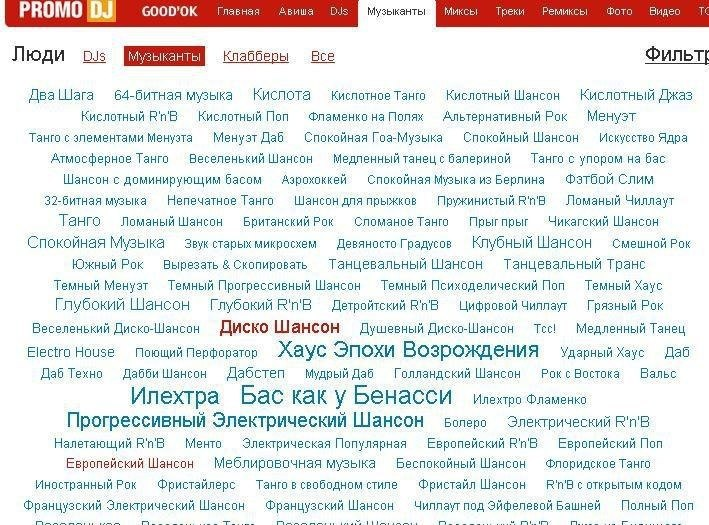

+++
title = "PromoDJ music genres"
date = 2025-06-02T20:27:34+00:00
description = "PromoDJ music genres"

[taxonomies]
tags = ["music"]

[extra]
tg_url = "https://t.me/vitaly_zdanevich_chan/546"
og_image = "5327905071423420414_1240499567_456259582.jpg"
next_id = 548
next_title = "New small project: python script for gthumb (or other software, even standalone CLI) that read EXIF GPS and open openstreetmap"
prev_id = 545
prev_title = "Vector TD: map BEGINNER: SWITCH BACK."
views = 53
ids = [546]
+++

PromoDJ {{ tag(t="music") }} genres

