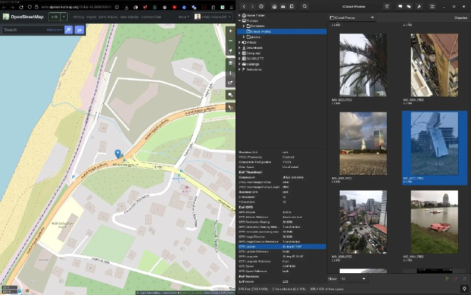

+++
title = ""
date = 2025-06-04T00:23:52+00:00
description = "New small project: python script for gthumb (or other software, even standalone CLI) that read EXIF GPS and open openstreetmap"

[taxonomies]
days = ["2025-06-04"]
tags = ["python", "gthumb", "openstreetmap"]

[extra]
id = 548
day = "2025-06-04"
tg_url = "https://t.me/vitaly_zdanevich_chan/548"
og_image = "5330353748242985817_1241069694_456258393.jpg"
next_id = 549
next_title = ""
next_body = "Another #userstyle: for #openstreetmap, only a few CSS lines"
prev_id = 546
prev_title = ""
prev_body = "PromoDJ #music genres"
views = 52
ids = [548]
+++

New small project: {{ tag(t="python") }} script for {{ tag(t="gthumb") }} (or other software, even standalone CLI) that read EXIF GPS and open {{ tag(t="openstreetmap") }}  

<https://gitlab.com/vitaly-zdanevich/image-path-to-openstreetmap>

