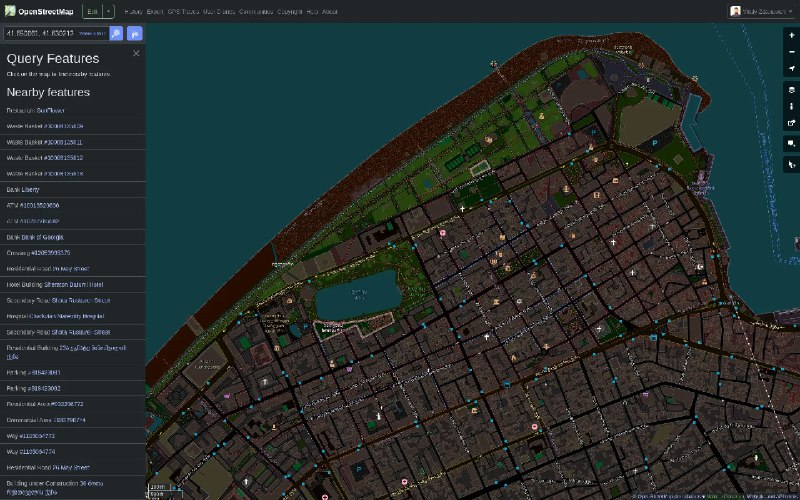

+++
title = "Another userstyle: for openstreetmap, only a few CSS lines"
date = 2025-06-04T00:24:53+00:00
description = "Another userstyle: for openstreetmap, only a few CSS lines"

[taxonomies]
tags = ["userstyle", "openstreetmap"]

[extra]
tg_url = "https://t.me/vitaly_zdanevich_chan/549"
og_image = "5330353748242985818_1241069694_456258394.jpg"
next_id = 550
next_title = "languages mix"
prev_id = 548
prev_title = "New small project: python script for gthumb (or other software, even standalone CLI) that read EXIF GPS and open openstreetmap"
views = 55
ids = [549]
+++

Another {{ tag(t="userstyle") }}: for {{ tag(t="openstreetmap") }}, only a few CSS lines

<https://gitlab.com/vitaly-zdanevich-styles/openstreetmap>

