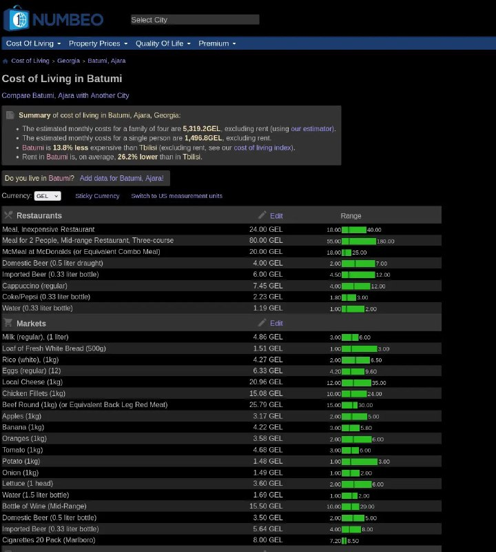

+++
title = "My new dark_mode: numbeo.com"
date = 2025-06-10T11:38:32+00:00
description = "My new darkmode: numbeo.com"

[taxonomies]
tags = ["dark_mode"]

[extra]
tg_url = "https://t.me/vitaly_zdanevich_chan/566"
og_image = "5350564279495029241_1245775325_456258041.jpg"
next_id = 567
next_title = "Dark pattern"
prev_id = 565
prev_title = "webdesign"
views = 33
ids = [566]
+++

My new {{ tag(t="dark_mode") }}: [numbeo.com](http://numbeo.com/)

<https://gitlab.com/vitaly-zdanevich/numbeo-com>

