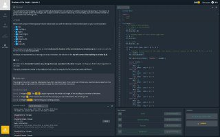

+++
title = ""
date = 2025-06-13T20:14:03+00:00
description = "livecoding batman binarysearch leetcode with games :("

[taxonomies]
days = ["2025-06-13"]
tags = ["livecoding", "batman", "binary_search", "leetcode"]

[extra]
id = 571
day = "2025-06-13"
tg_url = "https://t.me/vitaly_zdanevich_chan/571"
og_image = "01.jpg"
next_id = 573
next_title = ""
next_body = "#archiving\nLost."
prev_id = 570
prev_title = ""
prev_body = "#meditation\n#dantealigieri\nSource"
views = 31
ids = [571]

[[extra.related]]
path = "@/posts/2026-05-06-1747/index.md"
label = "Oh my... #leetcode"

[[extra.related]]
path = "@/posts/2026-05-06-1749/index.md"
label = "#leetcode #validation"

[[extra.related]]
path = "@/posts/2026-05-06-1746/index.md"
label = "#leetcode is often produce #error"

[[extra.related]]
path = "@/posts/2026-05-12-1753/index.md"
label = "#heap #lt Wow in #leetcode we can #patch classes: ListNode.lt =…"
+++

{{ tag(t="livecoding") }}  
{{ tag(t="batman") }}  
{{ tag(t="binary_search") }}  

{{ tag(t="leetcode") }} with games :(  

<https://www.codingame.com/ide/puzzle/shadows-of-the-knight-episode-1>  

<https://en.wikipedia.org/wiki/Binary_search>

*▶ video — 0:59*
