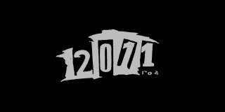

+++
title = ""
date = 2025-06-16T16:35:23+00:00
description = "my film korolishut alcohol s1e6"

[taxonomies]
days = ["2025-06-16"]
tags = ["my", "film", "korol_i_shut", "alcohol"]

[extra]
id = 575
day = "2025-06-16"
tg_url = "https://t.me/vitaly_zdanevich_chan/575"
og_image = "01.jpg"
next_id = 576
next_title = ""
next_body = "#photo\n#batumi\n#chandelier"
prev_id = 574
prev_title = ""
prev_body = "#korolishut\nSource"
views = 37
ids = [575]

[[extra.related]]
path = "@/posts/2023-07-16-27/index.md"
label = "#my #film #korolishut"

[[extra.related]]
path = "@/posts/2023-07-16-26/index.md"
label = "#film #korolishut Love this scene from Korol i Shut, episode 2"

[[extra.related]]
path = "@/posts/2025-10-20-710/index.md"
label = "#film #korolishut #naked"

[[extra.related]]
path = "@/posts/2025-01-17-255/index.md"
label = "#my #movie #korolishut"

[[extra.related]]
path = "@/posts/2025-01-17-254/index.md"
label = "#my #movie #korolishut"
+++

{{ tag(t="my") }}  
{{ tag(t="film") }}  
{{ tag(t="korol_i_shut") }}  
{{ tag(t="alcohol") }}  

s1e6  

<https://en.wikipedia.org/wiki/Korol_i_Shut>  
[https://ru.wikipedia.org/wiki/Король\_и\_Шут](https://ru.wikipedia.org/wiki/%D0%9A%D0%BE%D1%80%D0%BE%D0%BB%D1%8C_%D0%B8_%D0%A8%D1%83%D1%82)  
[https://ru.wikipedia.org/wiki/Король\_и\_Шут\_(сериал)](https://ru.wikipedia.org/wiki/%D0%9A%D0%BE%D1%80%D0%BE%D0%BB%D1%8C_%D0%B8_%D0%A8%D1%83%D1%82_(%D1%81%D0%B5%D1%80%D0%B8%D0%B0%D0%BB))

*▶ video — 3:53*
