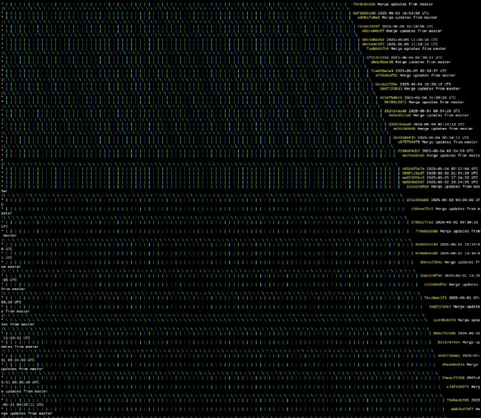

+++
title = "git git_graph"
date = 2025-06-27T22:42:53+00:00
description = "git gitgraph"

[taxonomies]
tags = ["git", "git_graph"]

[extra]
tg_url = "https://t.me/vitaly_zdanevich_chan/591"
og_image = "5402297976619135579_1257820515_456258139.jpg"
next_id = 592
next_title = "book Designing Data-Intensive Applications and wine"
prev_id = 590
prev_title = "comment health magnesium"
views = 46
ids = [591]
+++

{{ tag(t="git") }}
{{ tag(t="git_graph") }}

