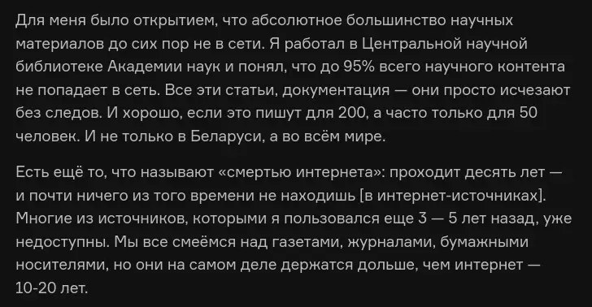

+++
title = ""
date = 2025-07-04T15:26:27+00:00
description = "preservation belarus library science Для меня было открытием, что абсолютное большинство научных материалов до сих пор не в сети. Я работал в Центральной научной библиотеке Академии наук и понял, что…"

[taxonomies]
days = ["2025-07-04"]
tags = ["preservation", "belarus", "library", "science"]

[extra]
id = 595
day = "2025-07-04"
tg_url = "https://t.me/vitaly_zdanevich_chan/595"
og_image = "5422520353390981486_1262528904_456257902.jpg"
next_id = 596
next_title = ""
next_body = "My another #userscript: small toggle for #darkmode on #stackexchange\n// ==UserScript==\n// @name StackExchange dark mode work-in-progress\n// @version 2025july4\n// @description From\n// @author daniel.z.tg and Vitaly Zdanevich\n// @match\n// @match\n// @match\n// @match\n// @match\n// @match\n// @run-at document-body\n// ==/UserScript==\n// NOT working for all sites\ndocument.body.classList.add('theme-dark');"
prev_id = 594
prev_title = ""
prev_body = "#webdesign\n#plan9"
views = 50
ids = [595]
+++

{{ tag(t="preservation") }}  
{{ tag(t="belarus") }}  
{{ tag(t="library") }}  
{{ tag(t="science") }}  

> Для меня было открытием, что абсолютное большинство научных материалов до сих пор не в сети. Я работал в Центральной научной библиотеке Академии наук и понял, что до 95% всего научного контента не попадает в сеть. Все эти статьи, документация — они просто исчезают без следов. И хорошо, если это пишут для 200, а часто только для 50 человек. И не только в Беларуси, а во всём мире.       Есть ещё то, что называют «смертью интернета»: проходит десять лет — и почти ничего из того времени не находишь \[в интернет-источниках\].  Многие из источников, которыми я пользовался еще 3 — 5 лет назад, уже недоступны. Мы все смеёмся над газетами, журналами, бумажными носителями, но они на самом деле держатся дольше, чем интернет — 10-20 лет.      Википедия — это инструмент, который позволяет хранить материалы в удобном формате, иначе они просто исчезли бы.

<https://devby.io/news/belwiki>

