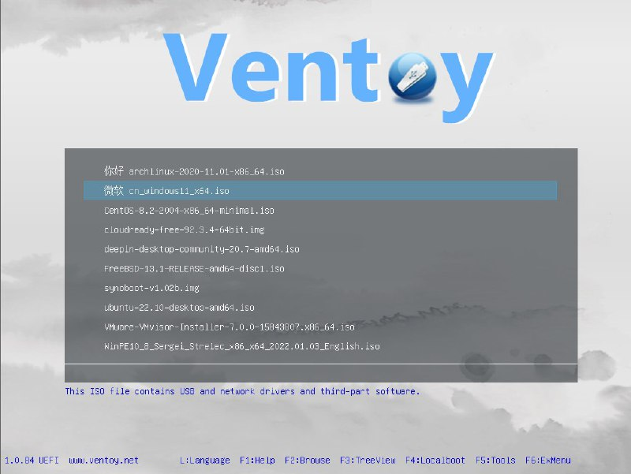

+++
title = ""
date = 2025-07-18T11:01:28+00:00
description = "ventoy is a dream - cp ISOs to USB and choose any to boot. And it faster to boot than dd because ISOs are compressed."

[taxonomies]
days = ["2025-07-18"]
tags = ["ventoy"]

[extra]
id = 599
day = "2025-07-18"
tg_url = "https://t.me/vitaly_zdanevich_chan/599"
og_image = "5462915113515351326_1271934042_456260894.jpg"
next_id = 600
next_title = ""
next_body = "#religion\n#architecture\n#church\n#germany\nSource"
prev_id = 598
prev_title = ""
prev_body = "mkdir aaa/bbb/ccc\ncp f aaa/bbb/ccc\nCan be simpler with the install command:\ninstall -D f aaa/bbb/ccc\nAnd even with integrated chmod:\nchmod 644 f\nWith a single command:\ninstall -Dm644 f aaa/bbb/ccc"
views = 40
ids = [599]
+++

{{ tag(t="ventoy") }} is a dream - `cp` ISOs to USB and choose any to boot.  

And it faster to boot than `dd` because ISOs are compressed.  

<https://www.ventoy.net/en/index.html>

