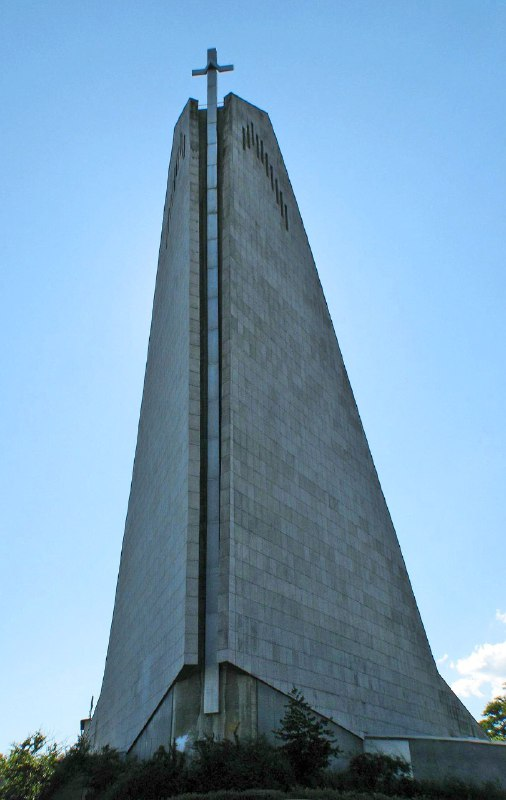

+++
title = ""
date = 2025-07-18T14:48:40+00:00
description = "religion architecture church germanySource"

[taxonomies]
days = ["2025-07-18"]
tags = ["religion", "architecture", "church", "germany"]

[extra]
id = 600
day = "2025-07-18"
tg_url = "https://t.me/vitaly_zdanevich_chan/600"
og_image = "5465166913329034167_1272458330_456258487.jpg"
next_id = 601
next_title = ""
prev_id = 599
prev_title = ""
views = 43
ids = [600]
+++

{{ tag(t="religion") }}
{{ tag(t="architecture") }}
{{ tag(t="church") }}
{{ tag(t="germany") }}[Source](https://commons.wikimedia.org/wiki/File:Wiesbaden_-_Mariae_Heimsuchung.jpg)

