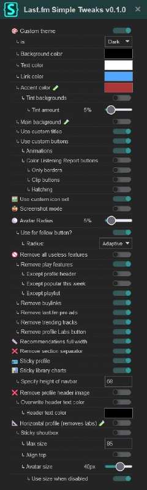

+++
title = ""
date = 2025-07-25T00:56:00+00:00
description = "Can you imagine userstyle with so much configs lastfm"

[taxonomies]
days = ["2025-07-25"]
tags = ["userstyle", "lastfm"]

[extra]
id = 610
day = "2025-07-25"
tg_url = "https://t.me/vitaly_zdanevich_chan/610"
og_image = "5194917018330068550_1209535873_456259142.jpg"
next_id = 611
next_title = ""
prev_id = 609
prev_title = ""
views = 55
ids = [610]
+++

Can you imagine {{ tag(t="userstyle") }} with so much [configs](https://github.com/924e50c0/Last.fmSimpleTweaks)

{{ tag(t="lastfm") }}

