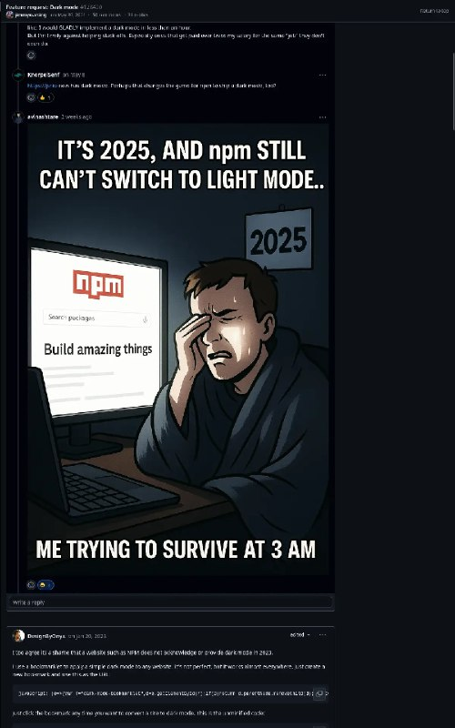

+++
title = ""
date = 2025-08-05T16:12:55+00:00
description = "How to ask for a darkmode"

[taxonomies]
days = ["2025-08-05"]
tags = ["dark_mode"]

[extra]
id = 615
day = "2025-08-05"
tg_url = "https://t.me/vitaly_zdanevich_chan/615"
og_image = "5229224641564899537_1217523739_456259793.jpg"
next_id = 616
next_title = ""
next_body = "#darkmode\n#gif"
prev_id = 614
prev_title = ""
prev_body = "#telegram bot that sends to email, its mean to #evernote too!\n@selfmailbot\nArticle from author"
views = 32
ids = [615]
+++

How to ask for a {{ tag(t="dark_mode") }}  

<https://github.com/orgs/community/discussions/128400#discussioncomment-13892335>

